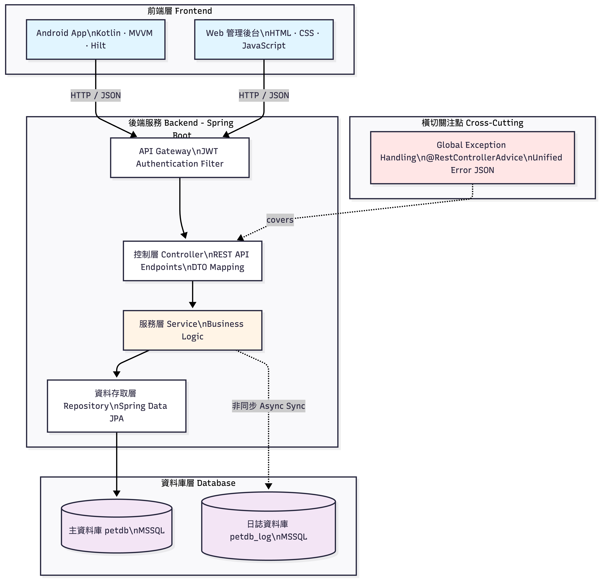
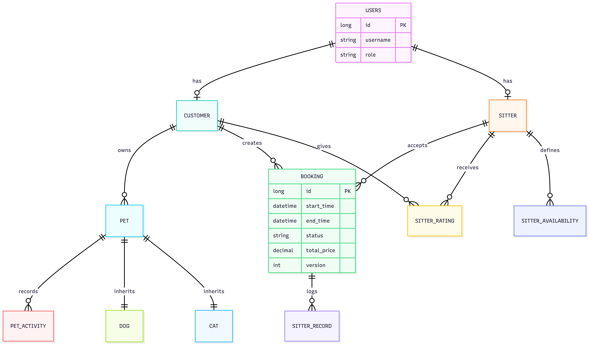

# Pet Care System 🐾

一個完整的寵物照護預約系統,包含 Web 管理介面、Android App、後端 API 和資料庫。

---

## 🏗️ 系統架構圖 (System Architecture)




**說明：**
- Android App（Kotlin / MVVM / Hilt）與 Web 管理後台透過 HTTP/JSON 呼叫後端 API
- 後端使用 Spring Boot，透過 JWT Authentication Filter 進行統一認證
- 採用 Controller / Service / Repository 分層架構
- 主資料庫（petdb）與日誌資料庫（petdb_log）分離
- Log DB 同步採非同步處理，避免影響主交易效能

---

## 🗄️ 資料庫設計 (ER Diagram)




**設計重點：**
- Users 為帳號主體，依 role 區分 Customer / Sitter
- Booking 為核心交易表，包含時間區間、狀態與價格
- 使用 `version` 欄位支援樂觀鎖，避免重複預約
- 寵物支援 Dog / Cat 繼承設計
- Booking 與 Sitter 行為皆有獨立紀錄表，方便後續報表與分析

---

## 快速開始 🚀

### 方式一：Docker 一鍵啟動 

#### QAS 環境 (MSSQL + 完整服務)

```bash
# 1. 一鍵啟動所有服務 (資料庫 + 後端 + 前端)
./start.sh qas

# 2. 開啟瀏覽器
# Web 管理介面: http://localhost
# API Health Check: http://localhost:8080/api/health

# 3. 登入測試帳號
# 飼主: user01 / password123
# 保母: sitter01 / sitter123
# 管理員: admin / admin123

# 4. 停止服務
./stop.sh qas
```

**特色：**
- ✅ 自動建立 MSSQL 資料庫 (petdb, petdb_log)
- ✅ 自動初始化 Schema 和測試資料
- ✅ 自動啟動 Backend API + Frontend + Database
- ✅ 健康檢查確保服務正常啟動
- ✅ 一鍵停止所有服務

#### DEV 環境 (H2 + 快速開發)

```bash
# 使用 H2 in-memory 資料庫,更快速
./start.sh dev

# Web 管理介面: http://localhost:3000
# API: http://localhost:8080
```

---

### 方式二：IDE 本機開發 (開發除錯用)

#### 步驟 1: 啟動資料庫

```bash
# QAS 環境 - 使用 MSSQL
docker-compose -f docker-compose.db.yml up -d

# 等待資料庫啟動完成 (約 30-45 秒)
./test-db.sh

# 或 DEV 環境 - 不需要啟動資料庫 (使用 H2 in-memory)
```

#### 步驟 2: 啟動後端 (在 IDE 中)

**IntelliJ IDEA / Eclipse:**

1. 打開 `src/main/java/com/pet/PracticeApplication.java`
2. 右鍵 → Run 或 Debug
3. 修改啟動設定:
   - **QAS 環境**: VM options 加入 `-Dspring.profiles.active=qas`
   - **DEV 環境**: VM options 加入 `-Dspring.profiles.active=dev`

**或使用 Maven 指令:**

```bash
# QAS 環境 (需要先啟動 docker-compose.db.yml)
mvn spring-boot:run -Dspring-boot.run.arguments="--spring.profiles.active=qas"

# DEV 環境 (使用 H2，不需要資料庫)
mvn spring-boot:run -Dspring-boot.run.arguments="--spring.profiles.active=dev"
```

#### 步驟 3: 啟動前端

**方式 A: 直接用瀏覽器開啟 (開發用)**

```bash
# 直接開啟 frontend/index.html
open frontend/index.html

# 注意: 需要修改 frontend/js/config.js 的 API_BASE_URL
# API_BASE_URL: 'http://localhost:8080/api'
``
```

**方式 B: 使用 Nginx (正式環境)**

```bash
# 使用 Docker 啟動 Frontend
docker-compose -f docker-compose.qas.yml up -d frontend

# 訪問 http://localhost (QAS) 或 http://localhost:3000 (DEV)
```

#### 步驟 4: 測試

```bash
# 測試 Backend API
curl http://localhost:8080/api/health

# 測試登入
curl -X POST http://localhost:8080/api/auth/login \
  -H "Content-Type: application/json" \
  -d '{"username":"user01","password":"password123"}'

# 訪問 Frontend
open http://localhost:3000  # DEV
# 或
open http://localhost       # QAS (如果用 Docker 啟動 Frontend)
```

#### 停止服務

```bash
# 停止資料庫
docker-compose -f docker-compose.db.yml down

# 停止 Frontend (如果用 Docker 啟動)
docker-compose -f docker-compose.qas.yml stop frontend

# Backend 在 IDE 中直接停止即可
```

---

## 環境說明 📋

| 環境 | 資料庫 | Web Port | Backend Port | 啟動方式 | 用途 |
|------|--------|----------|--------------|----------|------|
| **DEV** | H2 (記憶體) | 3000 | 8080 | `./start.sh dev` | 快速開發測試 |
| **QAS** | MSSQL | 80 | 8080 | `./start.sh qas` | 面試展示/UAT |
| **IDE** | MSSQL / H2 | 3000* | 8080 | 手動啟動 | 開發除錯 |


- **適用場景**: 開發新功能、問題排查

## 專案結構 📁

```
Pet/
├── src/                        # 後端 Spring Boot 程式碼
│   ├── main/java/com/pet/
│   │   ├── config/            # 配置類 (Security, CORS, JWT)
│   │   ├── domain/            # 實體類 (Pet, User, Booking...)
│   │   ├── repository/        # JPA Repository
│   │   ├── service/           # 業務邏輯
│   │   ├── web/               # REST Controllers
│   │   └── security/          # JWT 認證相關
│   └── main/resources/
│       ├── application.yml            # 通用配置
│       ├── application-dev.yml        # DEV 環境配置 (H2)
│       ├── application-qas.yml        # QAS 環境配置 (MSSQL)
│       └── db/
│           ├── schema-h2.sql          # H2 資料庫 Schema
│           ├── schema-mssql.sql       # MSSQL 資料庫 Schema
│           ├── data-h2.sql            # H2 測試資料
│           └── data-mssql-simple.sql  # MSSQL 測試資料
│
├── frontend/                   # Web 前端 (HTML/CSS/JS)
│   ├── index.html             # 登入頁面
│   ├── dashboard.html         # 管理介面
│   ├── js/
│   │   ├── config.js          # API 配置
│   │   ├── api.js             # API 封裝
│   │   └── login.js           # 登入邏輯
│   ├── css/                   # 樣式檔案
│   ├── nginx.conf             # Nginx 配置
│   └── Dockerfile             # Frontend Docker 映像檔
│
├── android-app/               # Android App (Kotlin)
│   └── ...                    # Gradle 專案結構
│
├── docker/                    # Docker 相關設定
│   └── mssql/
│       ├── Dockerfile         # MSSQL 自訂映像檔
│       ├── init-db.sql        # 資料庫初始化腳本
│       └── entrypoint.sh      # MSSQL 啟動腳本
│
├── Dockerfile                 # 後端 Docker 映像檔 (多階段建置)
├── docker-compose.dev.yml     # DEV 環境 (H2 + Backend + Frontend)
├── docker-compose.qas.yml     # QAS 環境 (MSSQL + Backend + Frontend)
├── docker-compose.db.yml      # 單獨資料庫 (IDE 開發用)
│
├── .env.dev                   # DEV 環境變數
├── .env.qas                   # QAS 環境變數
│
├── start.sh                   # 一鍵啟動腳本
├── stop.sh                    # 停止服務腳本
├── test-db.sh                 # 資料庫連線測試
│
├── pom.xml                    # Maven 配置
├── README.md                  # 本文件
└── INTERVIEW_QUICK_START.md  # 面試快速啟動指南
```

## 技術棧 💻

### 後端
- **Java 17** + **Spring Boot 3.2.1**
- **Spring Data JPA** (資料存取)
- **Spring Security** + **JWT** (認證授權)
- **MSSQL** / **H2** (資料庫)
- **Docker** (容器化)

### Web 前端
- **HTML5** + **CSS3** + **Vanilla JavaScript**
- **Nginx** (Web Server)

### Android App
- **Kotlin**
- **Gradle**

## 主要功能 ✨

- ✅ JWT 認證系統 (Access Token + Refresh Token)
- ✅ 寵物管理 (狗狗/貓咪專屬欄位)
- ✅ 保母預約系統
- ✅ 保母評價系統
- ✅ 保母儀表板
- ✅ 多角色管理 (管理員/飼主/保母)

## 開發指令 🛠️

### Docker 環境管理

```bash
# 查看所有服務狀態
# .env 沒有給 project name時 前面要加 -p pet-qas
docker-compose -f docker-compose.qas.yml ps

# 查看服務日誌
docker-compose -f docker-compose.qas.yml logs -f          # 所有服務
docker-compose -f docker-compose.qas.yml logs -f backend # 只看 Backend
docker-compose -f docker-compose.qas.yml logs -f mssql    # 只看資料庫

# 重啟特定服務
docker-compose -f docker-compose.qas.yml restart backend
docker-compose -f docker-compose.qas.yml restart frontend

# 重新建置並啟動
docker-compose -f docker-compose.qas.yml up -d --build

# 停止所有服務
./stop.sh qas

# 完全清除 (包含資料庫資料)
docker-compose -f docker-compose.qas.yml down -v
```

## 資料庫連線 (QAS) 🗄️

```
Host: localhost
Port: 1433
Database: petdb
Username: sa
Password: Passw0rd
```

## 常見問題 ❓

### Q1: Backend 無法啟動?

**症狀**: Backend 容器一直重啟或停止

**解決方案**:
```bash
# 1. 檢查 Docker 是否運行
docker ps

# 2. 檢查 port 8080 是否被佔用
lsof -i :8080  # macOS/Linux
netstat -ano | findstr :8080  # Windows

# 3. 查看詳細錯誤日誌
docker logs pet-backend-qas

# 4. 檢查是否正確使用 profile
docker logs pet-backend-qas 2>&1 | grep "profiles are active"
```

### Q2: 資料庫連線失敗?

**症狀**: Backend 啟動後顯示 "Cannot open database 'petdb'"

**解決方案**:
```bash
# 1. 等待資料庫完全啟動 (約 30-45 秒)
./test-db.sh

# 2. 查看資料庫日誌
docker-compose -f docker-compose.qas.yml logs mssql

# 3. 檢查資料庫是否已建立
docker exec pet-mssql-qas /opt/mssql-tools/bin/sqlcmd \
  -S localhost -U sa -P Passw0rd \
  -Q "SELECT name FROM sys.databases WHERE name IN ('petdb', 'petdb_log')"

# 4. 如果資料庫未建立，重新啟動 (會自動建立)
./stop.sh qas
docker-compose -f docker-compose.qas.yml down -v
./start.sh qas
```

### Q3: Frontend 登入失敗 (CORS 錯誤)?

**症狀**: 瀏覽器 Console 顯示 "CORS policy: No 'Access-Control-Allow-Origin' header"

**解決方案**:
```bash
# 1. 確認 CORS 設定正確 (application-qas.yml)
grep -A 2 "cors:" src/main/resources/application-qas.yml

# 應該顯示:
# cors:
#   allowed-origins: http://localhost,http://localhost:80,http://localhost:3000

# 2. 重新建置並啟動 Backend
docker-compose -f docker-compose.qas.yml build backend
docker-compose -f docker-compose.qas.yml up -d backend

# 3. 測試 CORS
curl -H "Origin: http://localhost" \
  -H "Access-Control-Request-Method: POST" \
  -X OPTIONS http://localhost:8080/api/auth/jwt/login -v
```

### Q4: 如何切換環境?

**DEV → QAS:**
```bash
./stop.sh dev
./start.sh qas
```

**QAS → DEV:**
```bash
./stop.sh qas
./start.sh dev
```

**IDE 開發 → Docker:**
```bash
# 停止 IDE 中的 Backend
# 停止資料庫
docker-compose -f docker-compose.db.yml down

# 啟動完整環境
./start.sh qas
```

### Q5: 如何完全重置資料?

**警告**: 這會刪除所有資料庫資料！

```bash
# 停止並刪除所有資料
./stop.sh qas
docker-compose -f docker-compose.qas.yml down -v

# 重新啟動 (會重新建立資料庫並匯入測試資料)
./start.sh qas
```

### Q6: 首次啟動很慢?

**原因**: Docker 需要下載 base images 和 Maven 需要下載依賴

**時間估計**:
- 首次啟動: 5-10 分鐘
- 之後啟動: 1-2 分鐘

**加速方法**:
```bash
# 預先下載 base images
docker pull eclipse-temurin:17-jre
docker pull maven:3.9-eclipse-temurin-17
docker pull nginx:alpine
docker pull mcr.microsoft.com/mssql/server:2019-latest
```

### Q7: 如何查看 Backend 使用哪個資料庫?

```bash
# 查看 Spring Profile
docker logs pet-backend-qas 2>&1 | grep "profiles are active"

# 查看資料庫連線 URL
docker logs pet-backend-qas 2>&1 | grep "Primary  DB URL"

# QAS 應該顯示: jdbc:sqlserver://mssql:1433;databaseName=petdb
# DEV 應該顯示: jdbc:h2:mem:testdb
```


## 作者 ✍️

**Justin**

---

**Last Updated**: 2026-01-25
**Version**: 2.0 (Multi-Environment Support)
