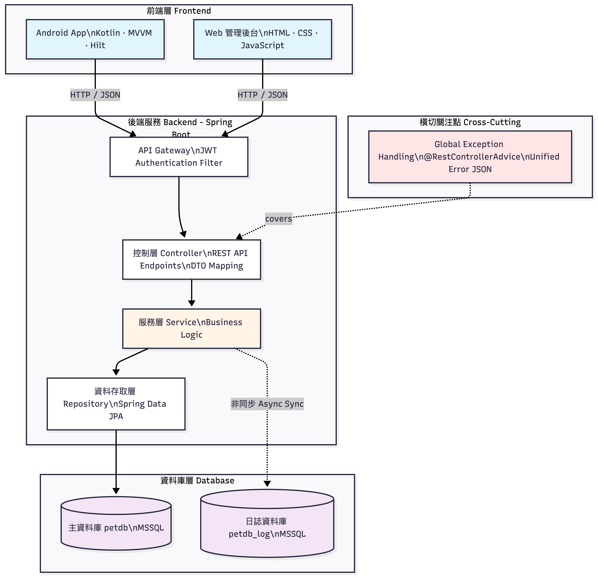
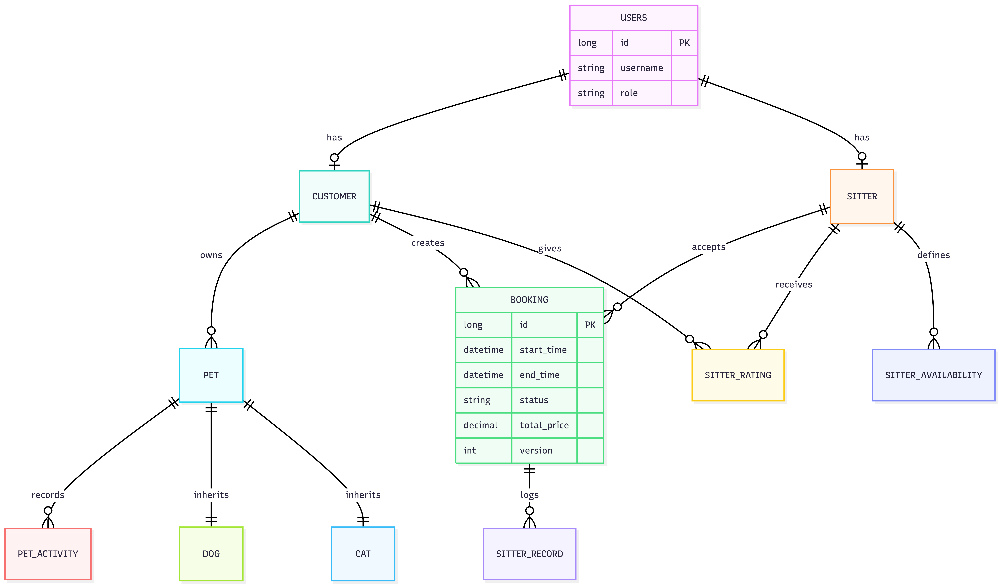

# Pet Care System 🐾

一個完整的寵物照護預約系統,包含 Web 管理介面、Android App、後端 API 和資料庫。

---

## 🏗️ 系統架構圖 (System Architecture)




**說明：**
- Android App（Kotlin / MVVM / Hilt）與 Web 管理後台透過 HTTP/JSON 呼叫後端 API
- 後端使用 Spring Boot，透過 JWT Authentication Filter 進行統一認證
- 採用 Controller / Service / Repository 分層架構
- 主資料庫（petdb）與日誌資料庫（petdb_log）分離
- Log DB 同步採非同步處理，避免影響主交易效能

---

## 🗄️ 資料庫設計 (ER Diagram)




**設計重點：**
- Users 為帳號主體，依 role 區分 Customer / Sitter
- Booking 為核心交易表，包含時間區間、狀態與價格
- 使用 `version` 欄位支援樂觀鎖，避免重複預約
- 寵物支援 Dog / Cat 繼承設計
- Booking 與 Sitter 行為皆有獨立紀錄表，方便後續報表與分析

---

## 快速開始 🚀

### 方式一：Docker 一鍵啟動 

#### QAS 環境 (MSSQL + 完整服務)

```bash
# 1. 一鍵啟動所有服務 (資料庫 + 後端 + 前端)
./start.sh qas

# 2. 開啟瀏覽器
# Web 管理介面: http://localhost
# API Health Check: http://localhost:8080/api/health

# 3. 登入測試帳號
# 飼主: user01 / password123
# 保母: sitter01 / sitter123
# 管理員: admin / admin123

# 4. 停止服務
./stop.sh qas
```

**特色：**
- ✅ 自動建立 MSSQL 資料庫 (petdb, petdb_log)
- ✅ 自動初始化 Schema 和測試資料
- ✅ 自動啟動 Backend API + Frontend + Database
- ✅ 健康檢查確保服務正常啟動
- ✅ 一鍵停止所有服務

#### DEV 環境 (H2 + 快速開發)

```bash
# 使用 H2 in-memory 資料庫,更快速
./start.sh dev

# Web 管理介面: http://localhost:3000
# API: http://localhost:8080
```

---

### 方式二：IDE 本機開發 (開發除錯用)

#### 步驟 1: 啟動資料庫

```bash
# QAS 環境 - 使用 MSSQL
docker-compose -f docker-compose.db.yml up -d

# 等待資料庫啟動完成 (約 30-45 秒)
./test-db.sh

# 或 DEV 環境 - 不需要啟動資料庫 (使用 H2 in-memory)
```

#### 步驟 2: 啟動後端 (在 IDE 中)

**IntelliJ IDEA / Eclipse:**

1. 打開 `src/main/java/com/pet/PracticeApplication.java`
2. 右鍵 → Run 或 Debug
3. 修改啟動設定:
   - **QAS 環境**: VM options 加入 `-Dspring.profiles.active=qas`
   - **DEV 環境**: VM options 加入 `-Dspring.profiles.active=dev`

**或使用 Maven 指令:**

```bash
# QAS 環境 (需要先啟動 docker-compose.db.yml)
mvn spring-boot:run -Dspring-boot.run.arguments="--spring.profiles.active=qas"

# DEV 環境 (使用 H2，不需要資料庫)
mvn spring-boot:run -Dspring-boot.run.arguments="--spring.profiles.active=dev"
```

#### 步驟 3: 啟動前端

**方式 A: 直接用瀏覽器開啟 (開發用)**

```bash
# 直接開啟 frontend/index.html
open frontend/index.html

# 注意: 需要修改 frontend/js/config.js 的 API_BASE_URL
# API_BASE_URL: 'http://localhost:8080/api'
``
```

**方式 B: 使用 Docker 啟動前端 (Nginx)**

```bash
# 建立前端 Docker Image
cd frontend
docker build -t pet-frontend .

# 啟動前端容器（後端在 IDE 本機執行時，需加 --add-host 讓 Nginx 反向代理指向本機）
docker run -p 3000:80 --add-host=backend:host-gateway pet-frontend

# 訪問 http://localhost:3000
# Nginx 會將 /api 請求反向代理到本機後端 localhost:8080
```

> **說明**: Nginx 設定中 `proxy_pass http://backend:8080`，`--add-host=backend:host-gateway` 會將 `backend` 解析為本機 IP，讓容器內的 Nginx 能打到 IDE 跑的後端。

#### 步驟 4: 測試

```bash
# 測試 Backend API
curl http://localhost:8080/api/health

# 測試登入
curl -X POST http://localhost:8080/api/auth/login \
  -H "Content-Type: application/json" \
  -d '{"username":"user01","password":"password123"}'

# 訪問 Frontend
open http://localhost:3000  # DEV
# 或
open http://localhost       # QAS (如果用 Docker 啟動 Frontend)
```

#### 停止服務

```bash
# 停止資料庫
docker-compose -f docker-compose.db.yml down

# 停止 Frontend (如果用 Docker 啟動)
docker-compose -f docker-compose.qas.yml stop frontend

# Backend 在 IDE 中直接停止即可
```

---

## 環境說明 📋

| 環境 | 資料庫 | Web Port | Backend Port | 啟動方式 | 用途 |
|------|--------|----------|--------------|----------|------|
| **DEV** | H2 (記憶體) | 3000 | 8080 | `./start.sh dev` | 快速開發測試 |
| **QAS** | MSSQL | 80 | 8080 | `./start.sh qas` | 面試展示/UAT |
| **IDE** | MSSQL / H2 | 3000* | 8080 | 手動啟動 | 開發除錯 |


- **適用場景**: 開發新功能、問題排查

## 專案結構 📁

```
Pet/
├── src/                        # 後端 Spring Boot 程式碼
│   ├── main/java/com/pet/
│   │   ├── config/            # 配置類 (Security, CORS, JWT)
│   │   ├── domain/            # 實體類 (Pet, User, Booking...)
│   │   ├── repository/        # JPA Repository
│   │   ├── service/           # 業務邏輯
│   │   ├── web/               # REST Controllers
│   │   └── security/          # JWT 認證相關
│   └── main/resources/
│       ├── application.yml            # 通用配置
│       ├── application-dev.yml        # DEV 環境配置 (H2)
│       ├── application-qas.yml        # QAS 環境配置 (MSSQL)
│       └── db/
│           ├── schema-h2.sql          # H2 資料庫 Schema
│           ├── schema-mssql.sql       # MSSQL 資料庫 Schema
│           ├── data-h2.sql            # H2 測試資料
│           └── data-mssql-simple.sql  # MSSQL 測試資料
│
├── frontend/                   # Web 前端 (HTML/CSS/JS)
│   ├── index.html             # 登入頁面
│   ├── dashboard.html         # 管理介面
│   ├── js/
│   │   ├── config.js          # API 配置
│   │   ├── api.js             # API 封裝
│   │   └── login.js           # 登入邏輯
│   ├── css/                   # 樣式檔案
│   ├── nginx.conf             # Nginx 配置
│   └── Dockerfile             # Frontend Docker 映像檔
│
├── android-app/               # Android App (Kotlin)
│   └── ...                    # Gradle 專案結構
│
├── docker/                    # Docker 相關設定
│   └── mssql/
│       ├── Dockerfile         # MSSQL 自訂映像檔
│       ├── init-db.sql        # 資料庫初始化腳本
│       └── entrypoint.sh      # MSSQL 啟動腳本
│
├── Dockerfile                 # 後端 Docker 映像檔 (多階段建置)
├── docker-compose.dev.yml     # DEV 環境 (H2 + Backend + Frontend)
├── docker-compose.qas.yml     # QAS 環境 (MSSQL + Backend + Frontend)
├── docker-compose.db.yml      # 單獨資料庫 (IDE 開發用)
│
├── .env.dev                   # DEV 環境變數
├── .env.qas                   # QAS 環境變數
│
├── start.sh                   # 一鍵啟動腳本
├── stop.sh                    # 停止服務腳本
├── test-db.sh                 # 資料庫連線測試
│
├── pom.xml                    # Maven 配置
├── README.md                  # 本文件
└── INTERVIEW_QUICK_START.md  # 面試快速啟動指南
```

## 技術棧 💻

### 後端
- **Java 17** + **Spring Boot 3.2.1**
- **Spring Data JPA** (資料存取)
- **Spring Security** + **JWT** (認證授權)
- **MSSQL** / **H2** (資料庫)
- **Docker** (容器化)

### Web 前端
- **HTML5** + **CSS3** + **Vanilla JavaScript**
- **Nginx** (Web Server)

### Android App
- **Kotlin**
- **Gradle**

## 主要功能 ✨

- ✅ JWT 認證系統 (Access Token + Refresh Token)
- ✅ 寵物管理 (狗狗/貓咪專屬欄位)
- ✅ 保母預約系統
- ✅ 保母評價系統
- ✅ 保母儀表板
- ✅ 多角色管理 (管理員/飼主/保母)

## 開發指令 🛠️

### Docker 環境管理

```bash
# 查看所有服務狀態
# .env 沒有給 project name時 前面要加 -p pet-qas
docker-compose -f docker-compose.qas.yml ps

# 查看服務日誌
docker-compose -f docker-compose.qas.yml logs -f          # 所有服務
docker-compose -f docker-compose.qas.yml logs -f backend # 只看 Backend
docker-compose -f docker-compose.qas.yml logs -f mssql    # 只看資料庫

# 重啟特定服務
docker-compose -f docker-compose.qas.yml restart backend
docker-compose -f docker-compose.qas.yml restart frontend

# 重新建置並啟動
docker-compose -f docker-compose.qas.yml up -d --build

# 停止所有服務
./stop.sh qas

# 完全清除 (包含資料庫資料)
docker-compose -f docker-compose.qas.yml down -v
```

## 資料庫連線 (QAS) 🗄️

```
Host: localhost
Port: 1433
Database: petdb
Username: sa
Password: Passw0rd
```

## 常見問題 ❓

### Q1: Backend 無法啟動?

**症狀**: Backend 容器一直重啟或停止

**解決方案**:
```bash
# 1. 檢查 Docker 是否運行
docker ps

# 2. 檢查 port 8080 是否被佔用
lsof -i :8080  # macOS/Linux
netstat -ano | findstr :8080  # Windows

# 3. 查看詳細錯誤日誌
docker logs pet-backend-qas

# 4. 檢查是否正確使用 profile
docker logs pet-backend-qas 2>&1 | grep "profiles are active"
```

### Q2: 資料庫連線失敗?

**症狀**: Backend 啟動後顯示 "Cannot open database 'petdb'"

**解決方案**:
```bash
# 1. 等待資料庫完全啟動 (約 30-45 秒)
./test-db.sh

# 2. 查看資料庫日誌
docker-compose -f docker-compose.qas.yml logs mssql

# 3. 檢查資料庫是否已建立
docker exec pet-mssql-qas /opt/mssql-tools/bin/sqlcmd \
  -S localhost -U sa -P Passw0rd \
  -Q "SELECT name FROM sys.databases WHERE name IN ('petdb', 'petdb_log')"

# 4. 如果資料庫未建立，重新啟動 (會自動建立)
./stop.sh qas
docker-compose -f docker-compose.qas.yml down -v
./start.sh qas
```

### Q3: Frontend 登入失敗 (CORS 錯誤)?

**症狀**: 瀏覽器 Console 顯示 "CORS policy: No 'Access-Control-Allow-Origin' header"

**解決方案**:
```bash
# 1. 確認 CORS 設定正確 (application-qas.yml)
grep -A 2 "cors:" src/main/resources/application-qas.yml

# 應該顯示:
# cors:
#   allowed-origins: http://localhost,http://localhost:80,http://localhost:3000

# 2. 重新建置並啟動 Backend
docker-compose -f docker-compose.qas.yml build backend
docker-compose -f docker-compose.qas.yml up -d backend

# 3. 測試 CORS
curl -H "Origin: http://localhost" \
  -H "Access-Control-Request-Method: POST" \
  -X OPTIONS http://localhost:8080/api/auth/jwt/login -v
```

### Q4: 如何切換環境?

**DEV → QAS:**
```bash
./stop.sh dev
./start.sh qas
```

**QAS → DEV:**
```bash
./stop.sh qas
./start.sh dev
```

**IDE 開發 → Docker:**
```bash
# 停止 IDE 中的 Backend
# 停止資料庫
docker-compose -f docker-compose.db.yml down

# 啟動完整環境
./start.sh qas
```

### Q5: 如何完全重置資料?

**警告**: 這會刪除所有資料庫資料！

```bash
# 停止並刪除所有資料
./stop.sh qas
docker-compose -f docker-compose.qas.yml down -v

# 重新啟動 (會重新建立資料庫並匯入測試資料)
./start.sh qas
```

### Q6: 首次啟動很慢?

**原因**: Docker 需要下載 base images 和 Maven 需要下載依賴

**時間估計**:
- 首次啟動: 5-10 分鐘
- 之後啟動: 1-2 分鐘

**加速方法**:
```bash
# 預先下載 base images
docker pull eclipse-temurin:17-jre
docker pull maven:3.9-eclipse-temurin-17
docker pull nginx:alpine
docker pull mcr.microsoft.com/mssql/server:2019-latest
```

### Q7: 如何查看 Backend 使用哪個資料庫?

```bash
# 查看 Spring Profile
docker logs pet-backend-qas 2>&1 | grep "profiles are active"

# 查看資料庫連線 URL
docker logs pet-backend-qas 2>&1 | grep "Primary  DB URL"

# QAS 應該顯示: jdbc:sqlserver://mssql:1433;databaseName=petdb
# DEV 應該顯示: jdbc:h2:mem:testdb
```


## HTTPS / ngrok 設定 🔒

本專案支援 HTTPS，透過環境變數切換，**不需改程式碼**。

### 開發環境：使用 ngrok（LINE Webhook 需要 HTTPS）

```bash
# 1. 安裝 ngrok
brew install ngrok

# 2. 首次設定（只需一次）
ngrok config add-authtoken <你的token>

# 3. 啟動 ngrok（每次開發時執行）
ngrok http 3000

# 會產生類似：https://abc123.ngrok-free.app
```

**設定 LINE Developers Console：**
- Webhook URL → `https://abc123.ngrok-free.app/api/line/webhook`
- LINE Login Callback → `https://abc123.ngrok-free.app/api/auth/oauth2/callback/line`

**更新 `.env`（或 `.env.dev` / `.env.qas`，看你用哪個環境）：**
```bash
# 必改：LINE 相關 URL 改為 ngrok 網址
LINE_BASE_URL=https://abc123.ngrok-free.app
LINE_FRONTEND_URL=https://abc123.ngrok-free.app

# 必改：CORS 加入 ngrok 網址
CORS_ORIGINS=https://abc123.ngrok-free.app,http://localhost:3000,http://localhost

# 注意：ngrok 開發時 COOKIE_SECURE 保持註解（不要啟用）
# 因為你本機仍是 HTTP，ngrok 到你的電腦這段是 HTTP
```

> ⚠️ 免費版每次重啟 ngrok 網址會變，需重新設定 LINE Console 和 `.env`。

### 使用 ngrok 時的 `.env` 修改清單

| 變數 | 原本 | 改成 |
|------|------|------|
| `LINE_BASE_URL` | `http://localhost:8080` | `https://xxx.ngrok-free.dev` |
| `LINE_FRONTEND_URL` | `http://localhost:3000` | `https://xxx.ngrok-free.dev` |
| `CORS_ORIGINS` | `http://localhost,...` | 加入 `https://xxx.ngrok-free.dev` |
| `COOKIE_SECURE` | 註解 | **不要動**（保持註解） |

### 正式環境：啟用 HTTPS

1. **準備 SSL 憑證**（Let's Encrypt 或自簽），放到 `./ssl/` 目錄
2. **取消 Nginx 註解**：打開 `frontend/nginx.conf`，取消 HTTPS server block 和 HTTP→HTTPS redirect
3. **設定環境變數**：
   ```bash
   COOKIE_SECURE=true
   CORS_ORIGINS=https://your-domain.com
   LINE_BASE_URL=https://your-domain.com
   LINE_FRONTEND_URL=https://your-domain.com
   ```
4. **Docker Compose 掛載 SSL**：
   ```yaml
   frontend:
     ports:
       - "443:443"
       - "80:80"
     volumes:
       - ./ssl:/etc/nginx/ssl:ro
   ```

### HTTPS 相關改動檔案

| 檔案 | 改動內容 |
|------|---------|
| `frontend/nginx.conf` | WebSocket `/ws` 反向代理、`X-Forwarded-Proto`、註解 HTTPS server block |
| `docker/nginx/nginx.conf` | 同上（混合模式用） |
| `application.yml` | `forward-headers-strategy: native`、`app.cookie.secure`、`cors.allowed-origins` |
| `AuthController.java` | Cookie `secure` 屬性改為讀取 `COOKIE_SECURE` 環境變數 |
| `docker-compose.dev.yml` | 註解 HTTPS 環境變數（`COOKIE_SECURE`、`CORS_ORIGINS`） |
| `docker-compose.qas.yml` | 同上 |

---

## WebSocket 即時通知 🔔

系統使用 STOMP over WebSocket 實現即時通知，預約狀態變更時自動推播給飼主和保母。

### 架構

```
Browser ──SockJS──▶ /ws (STOMP endpoint)
                        │
                        ▼
              WebSocketAuthInterceptor (JWT 驗證)
                        │
                        ▼
              WebSocketNotificationService
                        │
                        ▼
              /user/queue/notifications (點對點推播)
```

### 相關檔案

| 檔案 | 說明 |
|------|------|
| `WebSocketConfig.kt` | STOMP + SockJS 配置 |
| `WebSocketAuthInterceptor.kt` | STOMP CONNECT 時 JWT 驗證 |
| `WebSocketNotificationService.kt` | 發送通知到指定用戶 |
| `BookingService.java` | 交易提交後觸發 WebSocket + LINE 通知 |
| `api.js` | 前端 WebSocket 連線（含斷線重連） |

---

## LINE 整合 📱

### LINE 功能一覽

| 功能 | 說明 |
|------|------|
| LINE Login (OAuth 2.0) | 透過 LINE 帳號登入/註冊，自動選擇角色 (飼主/保母) |
| LINE Webhook | 接收 LINE 訊息事件（照片上傳、Postback） |
| LINE Rich Menu | 角色化選單：保母(上傳照片/預約)、飼主(寵物/預約)、未註冊(登入) |
| LINE 即時通知 | 預約狀態變更時推播 LINE 訊息給飼主/保母 |
| 照片上傳 (Quick Reply) | 保母透過 Rich Menu 選擇寵物 → 拍照 → 自動關聯寵物 |

### LINE Developers Console 設定

需要建立 **2 個 Channel**（同一個 Provider）：

| Channel 類型 | 用途 | 需設定 |
|-------------|------|--------|
| **Messaging API** | Webhook、Rich Menu、推播 | Webhook URL |
| **LINE Login** | OAuth 登入 | Callback URL |

**Callback URL 設定：**
```
# LINE Login → Callback URL
https://你的網址/api/auth/oauth2/callback/line

# Messaging API → Webhook URL
https://你的網址/api/line/webhook
```

> **重要**：兩個 Channel 必須在 **同一個 Provider** 下，這樣 userId 才會一致。

### 環境變數 (.env)

```bash
# === LINE Messaging API ===
LINE_CHANNEL_TOKEN=你的_Channel_Access_Token
LINE_CHANNEL_SECRET=你的_Channel_Secret

# === LINE Login ===
LINE_LOGIN_CHANNEL_ID=你的_Login_Channel_ID
LINE_LOGIN_CHANNEL_SECRET=你的_Login_Channel_Secret

# === URL（本機開發預設值，ngrok 時自動更新） ===
LINE_BASE_URL=http://localhost:8080
LINE_FRONTEND_URL=http://localhost:3000

# === CORS ===
CORS_ORIGINS=http://localhost:3000,http://localhost:8080
```

---

## ngrok 開發流程 🔗

使用 LINE 功能時需要 HTTPS 公開 URL，開發階段用 ngrok 實現。

### 快速啟動

```bash
# 一鍵啟動 ngrok + 自動更新所有設定
./ngrok-start.sh

# 腳本會自動：
# 1. 啟動 ngrok (tunnel 到 port 3000)
# 2. 更新 .env / .env.dev / .env.qas 的 LINE_BASE_URL、LINE_FRONTEND_URL、CORS_ORIGINS
# 3. 更新 LINE Messaging API 的 Webhook URL
# 4. 重建 Rich Menu（更新選單內的 URL）
```

### 手動步驟（首次或 ngrok-start.sh 不適用時）

```bash
# 1. 啟動 ngrok
ngrok http 3000

# 2. 取得 ngrok URL（例如 https://abc123.ngrok-free.dev）

# 3. 更新 LINE Developers Console
#    - LINE Login → Callback URL: https://abc123.ngrok-free.dev/api/auth/oauth2/callback/line
#    - Messaging API → Webhook URL: https://abc123.ngrok-free.dev/api/line/webhook
```

### IDE 開發注意事項

> ⚠️ **IntelliJ IDEA 不會自動讀取 `.env` 檔案！**

如果你用 **IDE 跑後端 + Docker 跑前端**，有兩種方式讓 LINE 功能正常：

**方式 A：使用動態 URL 推導（推薦，已內建）**

系統已內建透過 `X-Forwarded-Host` header 動態推導 URL 的機制：
- OAuth callback URL → 自動從 request header 推導
- 前端 redirect URL → 自動從 request header 推導
- CORS → 已加入 `*.ngrok-free.app` 和 `*.ngrok-free.dev` 萬用字元

只要 nginx 正確轉發 header（已設定好），**不需要手動設定 IDE 環境變數**。

**方式 B：手動設定 IntelliJ 環境變數**

如果方式 A 出問題，在 IntelliJ Run Configuration → Environment variables 加入：
```
LINE_BASE_URL=https://你的ngrok.ngrok-free.dev
LINE_FRONTEND_URL=https://你的ngrok.ngrok-free.dev
CORS_ORIGINS=https://你的ngrok.ngrok-free.dev,http://localhost:3000,http://localhost:8080
```

### 架構圖：ngrok + nginx + IDE 混合模式

```
手機/瀏覽器
    │
    ▼
ngrok (HTTPS) ── 設定 X-Forwarded-Host / X-Forwarded-Proto
    │
    ▼
Docker nginx (port 3000)
    ├── 靜態檔案 (/*.html, /js/*, /css/*) → 直接回傳
    └── /api/* → proxy_pass http://backend:8080 → IDE 後端
                  (--add-host=backend:host-gateway)
```

### ngrok 常見問題

| 問題 | 原因 | 解決 |
|------|------|------|
| Rich Menu 按鈕按了沒反應 | Rich Menu 內的 URL 是舊的 ngrok URL | 執行 `./ngrok-start.sh` 或呼叫 `POST /api/line/richmenu/recreate` |
| LINE 登入 400 Bad Request | LINE Console 的 Callback URL 與後端 redirect_uri 不一致 | 更新 LINE Login → Callback URL 為新 ngrok URL |
| 註冊失敗 "Invalid CORS request" | CORS 沒有允許 ngrok origin | 系統已自動允許 `*.ngrok-free.app/dev`，重啟後端即可 |
| 登入後被導回首頁 | redirect URL 指向 localhost，手機連不到 | 已透過 X-Forwarded-Host 自動修正 |

### 停止 ngrok

```bash
./ngrok-stop.sh
# 會清除 .env 中的 ngrok URL
```

---

## LINE Rich Menu 🎨

系統會根據使用者角色自動顯示不同的 Rich Menu：

| 角色 | 選單內容 | 自動綁定時機 |
|------|---------|-------------|
| 未註冊 | 「前往登入 / 註冊」 | 加入好友時 (follow event) |
| 保母 (SITTER) | 「📷 上傳照片」+「📋 我的預約」 | LINE 登入 / 註冊完成後 |
| 飼主 (CUSTOMER) | 「🐾 我的寵物」+「📋 我的預約」 | LINE 登入 / 註冊完成後 |

### Rich Menu API

```bash
# 手動重建所有 Rich Menu（ngrok URL 變更後使用）
curl -X POST http://localhost:8080/api/line/richmenu/recreate
```

### 相關檔案

| 檔案 | 說明 |
|------|------|
| `LineRichMenuService.kt` | Rich Menu 建立、圖片生成、角色綁定 |
| `LineWebhookService.kt` | Webhook 事件處理（Postback、Follow、照片） |
| `LineContentService.kt` | LINE API 封裝（Reply、Push、Quick Reply） |
| `LineOAuth2Service.java` | LINE Login OAuth 2.0 流程 |
| `SitterPetSelectionCache.kt` | 保母照片上傳的寵物選擇暫存 |
| `AuthController.java` | OAuth callback、動態 URL 推導 |
| `CorsConfig.java` | CORS 設定（含 ngrok 萬用字元） |
| `docker/nginx/nginx.conf` | nginx 反向代理 + X-Forwarded-Host 轉發 |

---

## 換電腦 / 新環境設定清單 📋

### 必裝軟體

- [ ] **JDK 17**（推薦 JetBrains Runtime 或 Eclipse Temurin）
- [ ] **Docker Desktop**
- [ ] **IntelliJ IDEA**（或 Eclipse）
- [ ] **ngrok**（`brew install ngrok`）
- [ ] **Git**

### 首次設定步驟

1. **Clone 專案**
   ```bash
   git clone <repo-url>
   cd pet
   ```

2. **建立 `.env` 檔案**（從範本複製）
   ```bash
   cp .env.example .env  # 如果有範本
   # 或手動建立，填入 LINE Channel 資訊
   ```

3. **LINE Developers Console**
   - 確認 Messaging API Channel 和 LINE Login Channel 在同一 Provider
   - 取得 Channel Token、Secret、Channel ID
   - 填入 `.env`

4. **設定 ngrok**
   ```bash
   ngrok config add-authtoken <你的token>
   ```

5. **啟動開發環境**
   ```bash
   # 啟動前端 Docker
   docker build -t pet-frontend -f docker/Dockerfile.frontend .
   docker run -d -p 3000:80 --add-host=backend:host-gateway pet-frontend

   # 啟動 ngrok
   ./ngrok-start.sh

   # 更新 LINE Developers Console 的 LINE Login Callback URL
   # （Webhook URL 由腳本自動更新，但 Login Callback URL 需手動）

   # 在 IntelliJ 啟動後端
   # VM options: -Dspring.profiles.active=dev
   ```

6. **驗證**
   - 開啟 ngrok URL → 看到登入頁面
   - 點 LINE 登入 → 跳轉到 LINE 授權 → 回到角色選擇
   - 手機開 LINE → 加入官方帳號 → 看到 Rich Menu

---

## 作者 ✍️

**Justin**

---

**Last Updated**: 2026-01-30
**Version**: 4.0 (LINE Rich Menu + OAuth + ngrok 動態 URL)
